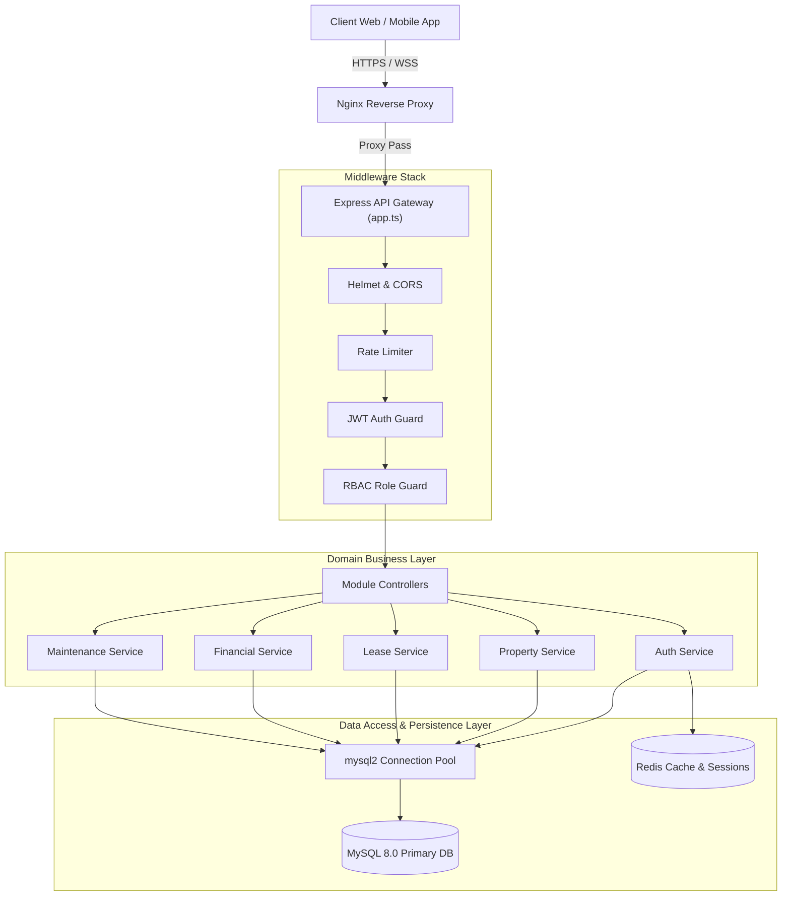
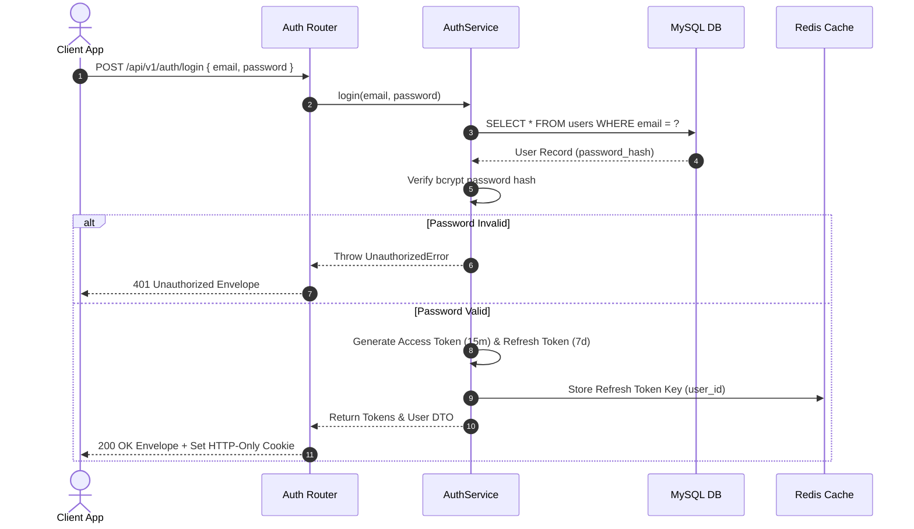
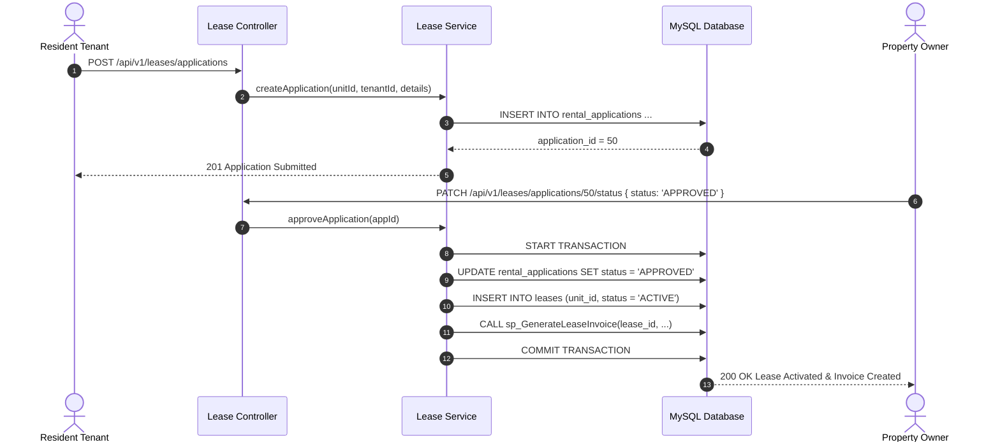
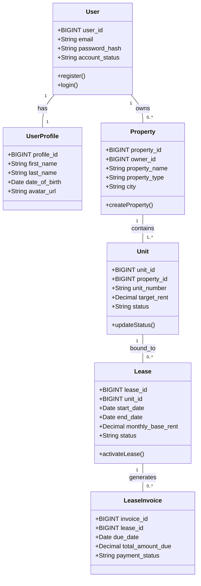
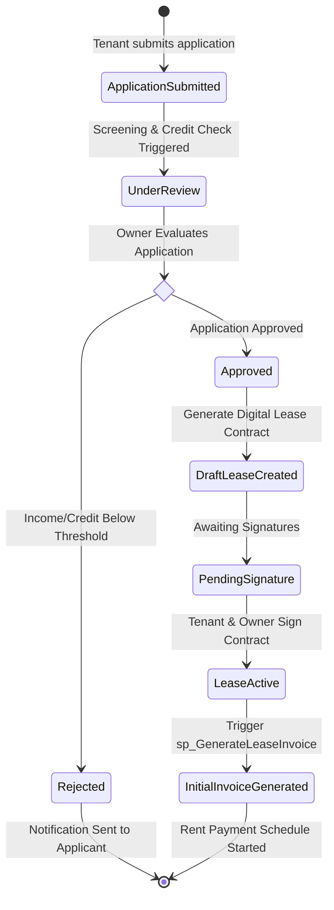
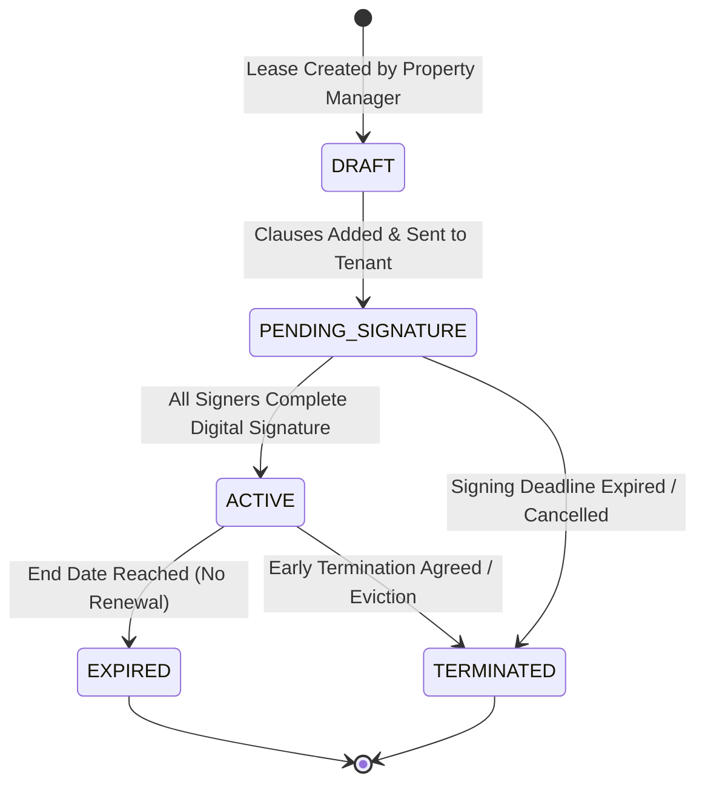
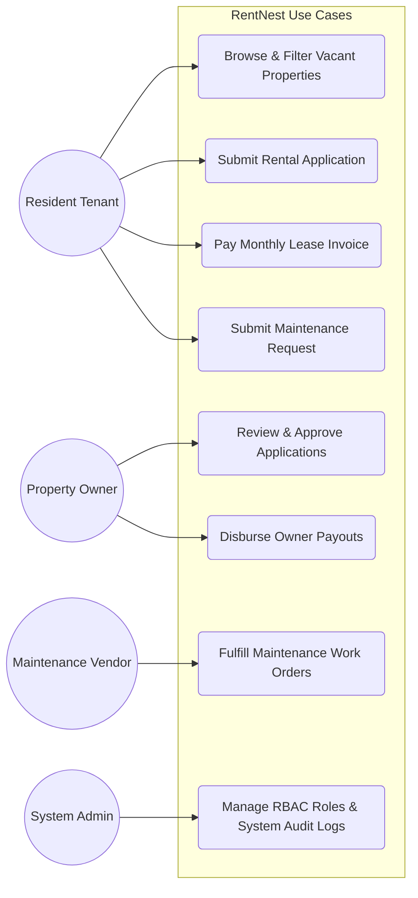
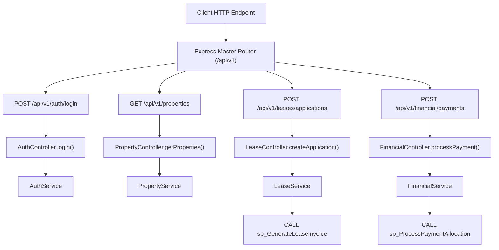
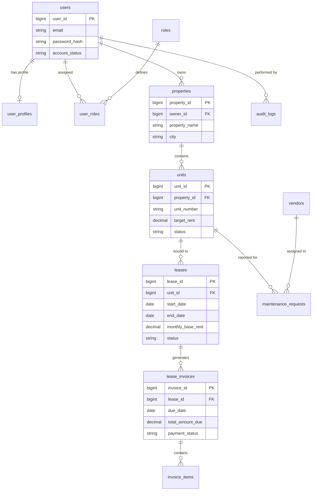

# RentNest SaaS Platform — Enterprise Software Engineering Documentation

> **Document Type**: Enterprise Software Architecture & System Design Document (SAD/HLD/LLD)  
> **System Architecture**: Modular Monolith (Layered Architecture: Controller-Service-Repository)  
> **Backend Technologies**: Node.js 20+ LTS / Express 4.x / TypeScript 5.7 / MySQL 8.0 / Socket.IO / Redis  
> **Target Audience**: Enterprise Software Architects, Principal Engineers, DBA & DevOps Engineers  
> **Document Version**: 1.0.0-ENTERPRISE  

---

## Executive Architectural Summary

The **RentNest SaaS Platform** is an enterprise-grade multi-tenant real estate and property management ecosystem. The backend is designed as a **High-Throughput Modular Monolith** operating on a clean **Controller-Service-Repository (CSR)** layered architecture. It cleanly separates HTTP routing, input validation (Zod schemas), domain logic execution, and database persistence (MySQL 8 Stored Procedures & Repositories).

---

## 1. Software Architecture Document (SAD)

### Architectural Goals & Design Principles
1. **Strict Separation of Concerns**: Decouples presentation/API layers from core business rules and database data access.
2. **Type Safety Across Layers**: End-to-end TypeScript interfaces shared between requests, DTOs, domain models, and API responses.
3. **Stateless Scale-Out**: Authentication relies on dual JWT tokens (Access + Refresh) and centralized Redis session invalidation, enabling zero-stickiness PM2 cluster scaling.
4. **Strict Auditability**: Automated database triggers and middleware audit trails record all administrative overrides and critical domain updates.

---

## 2. High-Level Design (HLD) & System Overview

The system consists of 13 core business sub-domains:

```
[ Client Applications ] ---> [ Cloudflare WAF ] ---> [ Nginx Reverse Proxy ]
                                                            |
                                                            v
                                                  [ Express API Gateway ]
                                                            |
     +-------------------+-------------------+--------------+--------------+-------------------+
     |                   |                   |                             |                   |
[ Auth Module ]   [ Property Module ] [ Lease Module ]           [ Financial Module ] [ Maintenance Module ]
     |                   |                   |                             |                   |
     +-------------------+-------------------+--------------+--------------+-------------------+
                                                            |
                                                 [ Stored Procedures ]
                                                            |
                                                   [ MySQL 8 Engine ]
```

---

## 3. Low-Level Design (LLD) & Pattern Standards

Each module follows a uniform directory structure and dependency injection model:

- `*.routes.ts`: Defines REST endpoint routes, HTTP verbs, and mounts authentication (`authenticateToken`) and authorization (`authorizeRoles`) middlewares.
- `*.controller.ts`: Handles Express `Request` and `Response`, parses query/params, delegates work to services, and formats standard envelopes via `ApiResponse`.
- `*.service.ts`: Implements business transactions, validations, stored procedure calls, and domain rules.
- `*.repository.ts`: Encapsulates raw SQL queries or DB pool procedures using `mysql2/promise`.

---

## 4. Component Diagram



---

## 5. Deployment Diagram

```mermaid
graph TB
    subgraph External Clients
        Desktop["Browser / Web App"]
        Mobile["Mobile Native App"]
    end

    subgraph Security Edge
        WAF["Cloudflare DNS & WAF"]
    end

    subgraph App Server Infrastructure (Ubuntu 22.04 LTS)
        Nginx["Nginx (SSL Termination TLS 1.3)"]
        
        subgraph PM2 Cluster Host
            Worker1["Express Node Worker 1"]
            Worker2["Express Node Worker 2"]
            WorkerN["Express Node Worker N"]
        end
    end

    subgraph Data Infrastructure Tier
        RedisCluster[("Redis Enterprise Cluster")]
        DBPrimary[("MySQL 8 Primary Writer")]
        DBReplica[("MySQL 8 Read Replica")]
    end

    Desktop --> WAF
    Mobile --> WAF
    WAF --> Nginx
    Nginx --> Worker1
    Nginx --> Worker2
    Nginx --> WorkerN
    
    Worker1 --> RedisCluster
    Worker2 --> RedisCluster
    WorkerN --> RedisCluster
    
    Worker1 --> DBPrimary
    Worker2 --> DBPrimary
    WorkerN --> DBPrimary
    
    DBPrimary -->|GTID Replication| DBReplica
```

---

## 6. Sequence Diagrams

### 6.1 Authentication & Dual JWT Generation Flow



### 6.2 Lease Application & Invoice Generation Flow



---

## 7. Class Diagrams



---

## 8. Package Diagram

```mermaid
graph TD
    subgraph Root Application Namespace
        App["app.ts (Express Application Setup)"]
        Server["server.ts (HTTP & Socket.IO Listener)"]
    end

    subgraph Shared Configuration Namespace ["src/config"]
        Env["env.config.ts"]
        DBConfig["database.config.ts"]
        CORSConfig["cors.config.ts"]
    end

    subgraph Security & Middleware Namespace ["src/middleware"]
        AuthMw["auth.middleware.ts"]
        RBACMw["rbac.middleware.ts"]
        RateMw["rate-limiter.middleware.ts"]
        ErrorMw["error.middleware.ts"]
    end

    subgraph Business Domain Modules Namespace ["src/modules"]
        AuthMod["modules/auth"]
        UserMod["modules/users"]
        PropMod["modules/properties"]
        LeaseMod["modules/leases"]
        FinMod["modules/financial"]
        MaintMod["modules/maintenance"]
        AdminMod["modules/admin"]
    end

    subgraph Persistence Namespace ["src/repositories"]
        UserRepo["user.repository.ts"]
        PropRepo["property.repository.ts"]
        LeaseRepo["lease.repository.ts"]
    end

    App --> Shared Configuration Namespace
    App --> Security & Middleware Namespace
    App --> Business Domain Modules Namespace
    Business Domain Modules Namespace --> Persistence Namespace
```

---

## 9. Activity Diagram (Lease Execution & Approval Workflow)



---

## 10. State Diagrams (Lease Lifecycle State Machine)



---

## 11. Use Case Diagram



---

## 12. API Interaction Diagram



---

## 13. Entity-Relationship Database Diagram


